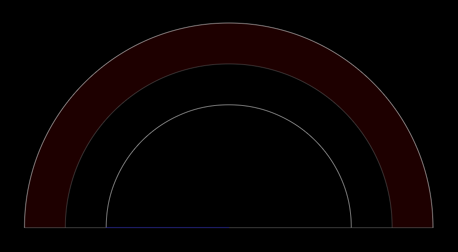
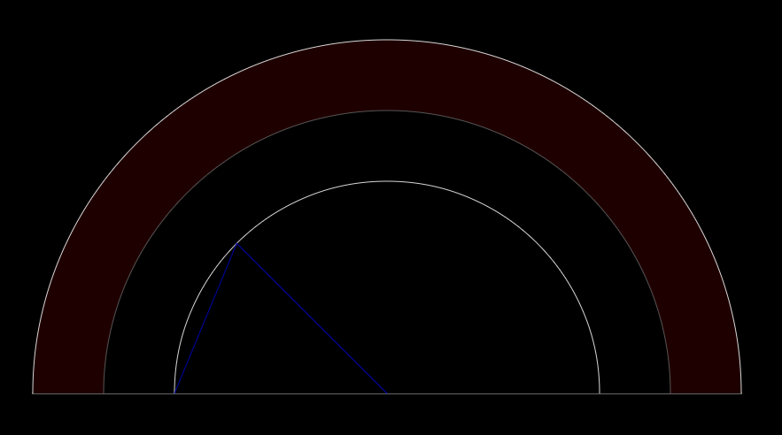
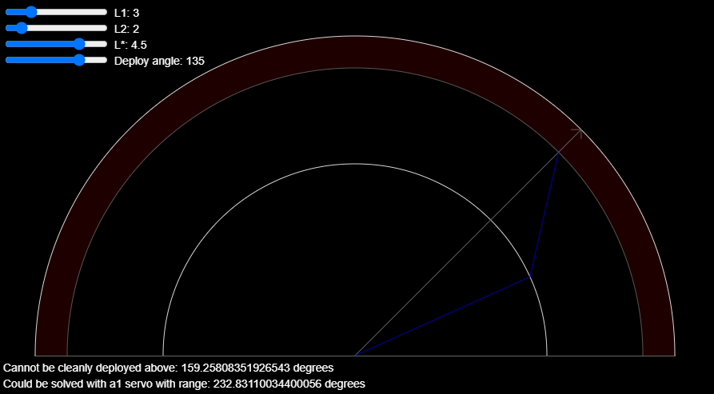
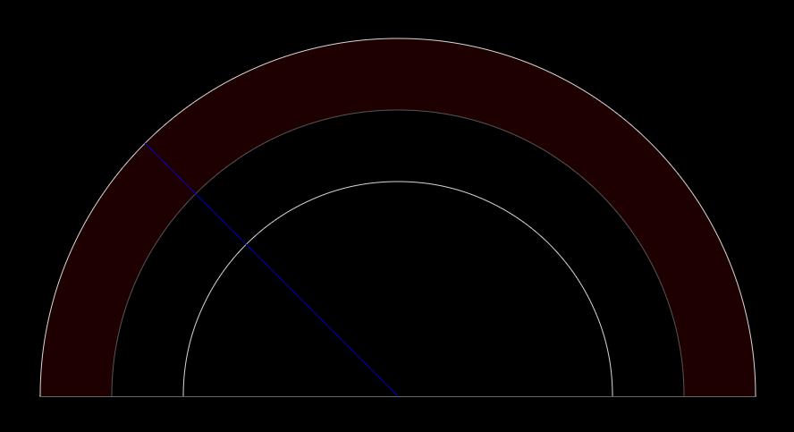
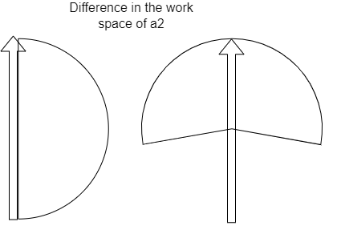
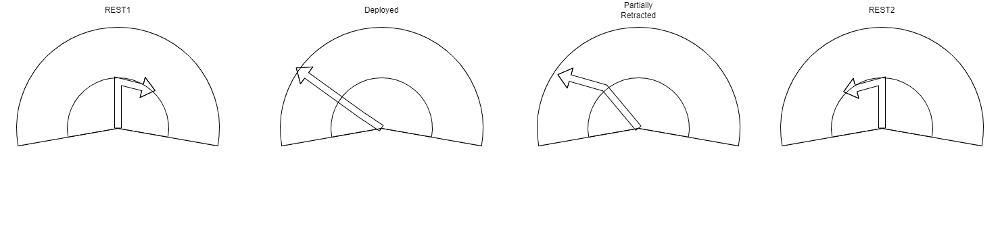
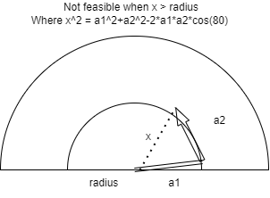
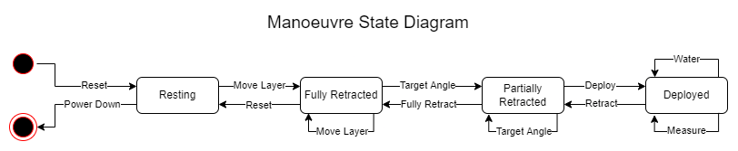

# Robot Movement

## Structure

### Layout
The robot is made up of layers (stacked horizontally) of 180 degree arc shaped planters. These planters are evenly split into sections. Plant pot a,b is the bth section on layer a (we use zero indexing).

### Acctuation
There are three acctuators labeled a1, a2 and a3 moving from the end effector out.
- a1 is a rotational join with range [0-180] (possibly to be changed) which is used for deploying and retracting the end efector.
- a2 is a rotational joint with range [0-180] which is used with a1 to deploy the end effector and controls the angle at which the end effector is ultimately deployed.
- a3 is a prismatic join with range [tbc] which moves the robot arm (containing a1 and a2) up and down between layers.

### Dimensions
- Length from end effector to a1: ?
- Length from a1 to a2: ?
- Height of robot arm for working on layer 0: ?
- Distance between layers: ?

*Possibly (likely) more dimensions of interest*

## Arm States

The robot arm can be in one of four states:
- Resting
- Fully retracted
- Partially retracted
- Deployed

### Resting
The resting state is (to be confirmed) when a1 and a2 are at 0. Additionally a3 will be moved too it's lowest state (which may not be aligned with the bottom layer). This state is likely only to be used when the robot is not doing anything and it would be good to find a way to sever power from the servos when in this state (as it may be in this state doing nothing for hours if not days).


### Fully Retracted
This state allows a3 to safely be used to move the end efector between layers. The arms are positioned such that both a2 (by definition) and the end effector are within the range of movement of a1. If the position of the arms does not already meet this condition (i.e. last state was not resting) then the end effector is placed on the boundry as can be seen in the diagram below.


### Partially Retracted
This state allows a2 to safely be used to move the arm in preperation for a deployment (or can be the end state from a retraction). The arms are arranged such that the end effector lies on the path of deployment to a given angle and the boundry of a region in which we do not want to allow 'sweeping' movements.
It should be noted that the pissible angles of deployment are limited to the right. 


## Deployed
The deployed state allows the sensor and water output on the end effector to be used. This is when a1 is set to 180 degrees and the robot arm is held straight. Although the arm can be in this deployed state at any angle, a range of angles to the right will not be reachable without sweeping motions in the non-sweeping zone. Increasing the acctuation of a1 could provide a solution to this if viable. 


### Alternative Set Up

## Workspace
a2 is a rotational joint with range [0-200] which is used with a1 to deploy the end effector and controls the angle at which the end effector is ultimately deployed.


## States
The rest state forms a V shape, so that the work space of a2 is 100 degrees each side, the robot arm under this set up could reach anywhere without sweeping a plant.


## Issues
However it will puts more burden on joint at a1 and it is not feasible if a2 is too long.


## Actions

### Reset

The robot must be in the fully retracted state in order to reset. a1 and a2 will be set to 0 degrees and a3 set to a resting position. This action will also be taken when the robot is in an unknown state (e.g. after boot) as it can safely bring the robot to a known state. However, this does not guarentee no sweeping motions in the non-sweeping zone.

This action may also need to re-suply power to the servos.

### Move Layer

To move layer the arm must either be resting or fully retracted. a3 can then be used to align the arm with the desired layer by setting it to that layer's height.

### Target Angle

This action prepairs the arm to deploy the end effector to a given angle. Joint angles are calculated as follows using the SSS equation:
```
l1 = length from a3 to a2
l2 = length from a2 to end effector
lx = length from a3 to non-sweeping zone boundry
θ  = angle for deployment

α = cos^-1((lx^2+l1^2-l2^2)/(2*lx*l2))) //pre-caluclated offset
a2 angle = θ + α
a1 angle = cos^-1((l1^2+l2^2-lx^2)/(2*l1*l2))) // can also be pre-calculated
```
### Deploy

Once in place using target angle deployment moves the arm to the deployed state by moving a1 and a2 in unison to have the end effector follow the straight deployment path.

*With l1≠l2 this may not be possible with the linear motions we currently have the servos capibale of making. Haven't been bothered enough to do the maths yet.*

### Water

Once deployed this action can be used to activate the watering mechanism. Current plan involves no movement for this action.

### Measure

Once deployed this action can be used to measure the moisture in the soil at the current angle. a3 will be used to lower the probe into the soil then raise it back out.

### Retract

Essentially the deploy action in reverse.

### Fully Retract

This action moves a1 and a2 to reach the fully retracted state ready for moving between layers.

### Power Down

Severs power to the servos until they are next needed.

## Manouvres
All manouvers can be carried out by navigating between the arm states using the actions detailed above. The relationships between these states and actions can be more clearly seen in the diagram below.


